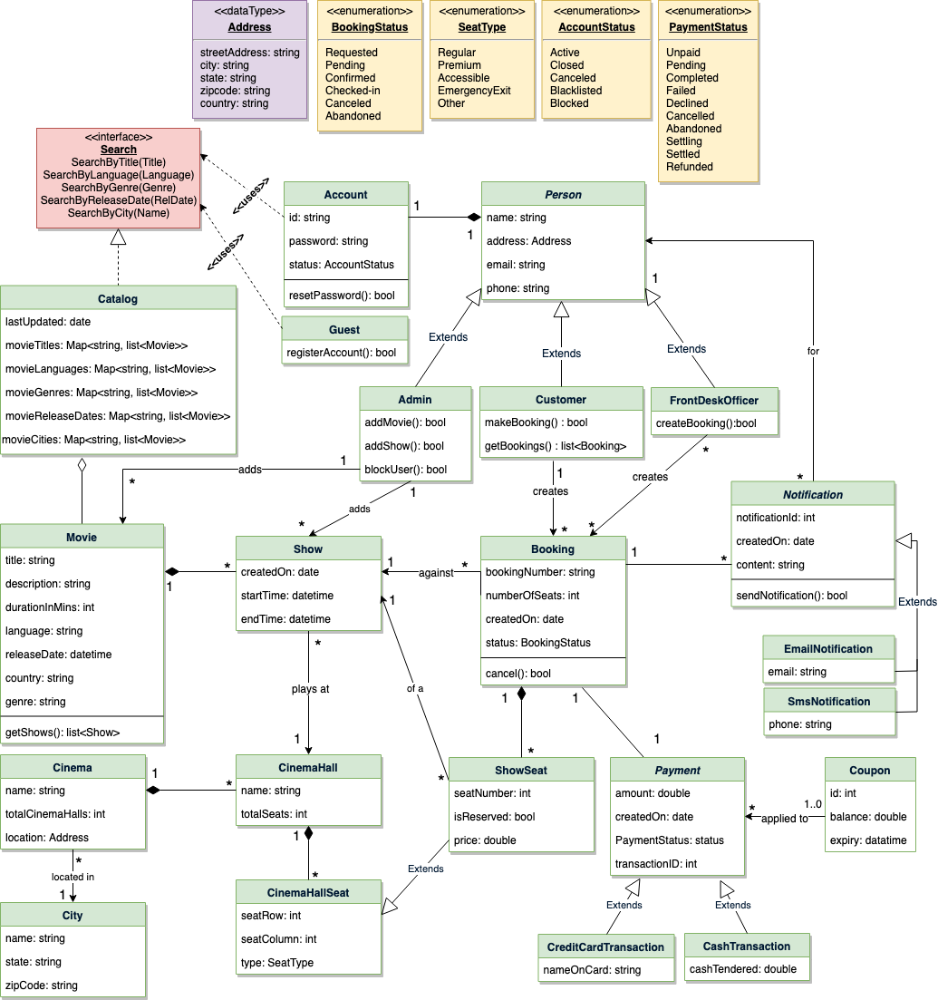

<h1 align="center">Design a Movie Ticket Booking System</h1>
<h3 align="center">Let's design Movie Ticket Booking System</h3>

**We'll cover the following:**

* [System Requirements](#system-requirements)
* [Use Case Diagram](#use-case-diagram)
* [Class Diagram](#class-diagram)
* [Activity Diagrams](#activity-diagrams)
* [Code](#code)
* [Concurrency](#concurrency)

An online movie ticket booking system facilitates the purchasing of movie tickets to its customers. E-ticketing systems allow customers to browse through movies currently playing and book seats, anywhere and anytime.

<p align="center">
    
    <br />
    Movie Ticket Booking System
</p>

### System Requirements

Our ticket booking service should meet the following requirements:

1. It should be able to list the cities where affiliate cinemas are located.
2. Each cinema can have multiple halls and each hall can run one movie show at a time.
3. Each Movie will have multiple shows.
4. Customers should be able to search movies by their title, language, genre, release date, and city name.
5. Once the customer selects a movie, the service should display the cinemas running that movie and its available shows.
6. The customer should be able to select a show at a particular cinema and book their tickets.
7. The service should show the customer the seating arrangement of the cinema hall. The customer should be able to select multiple seats according to their preference.
8. The customer should be able to distinguish between available seats and booked ones.
9. The system should send notifications whenever there is a new movie, as well as when a booking is made or canceled.
10. Customers of our system should be able to pay with credit cards or cash.
11. The system should ensure that no two customers can reserve the same seat.
12. Customers should be able to add a discount coupon to their payment.

### Use Case Diagram

We have five main Actors in our system:

* **Admin:** Responsible for adding new movies and their shows, canceling any movie or show, blocking/unblocking customers, etc.
* **FrontDeskOfficer:** Can book/cancel tickets.
* **Customer:** Can view movie schedules, book, and cancel tickets.
* **Guest:** All guests can search movies but to book seats they have to become a registered member.
* **System:** Mainly responsible for sending notifications for new movies, bookings, cancellations, etc.

Here are the top use cases of the Movie Ticket Booking System:

* **Search movies:** To search movies by title, genre, language, release date, and city name.
* **Create/Modify/View booking:** To book a movie show ticket, cancel it or view details about the show.
* **Make payment for booking:** To pay for the booking.
* **Add a coupon to the payment:** To add a discount coupon to the payment.
* **Assign Seat:** Customers will be shown a seat map to let them select seats for their booking.
* **Refund payment:** Upon cancellation, customers will be refunded the payment amount as long as the cancellation occurs within the allowed time frame.

Here is the use case diagram of Movie Ticket Booking System:

<p align="center">
    
    <br />
    Use Case Diagram for Movie Ticket Booking System
</p>

### Class Diagram

Here are the main classes of the Movie Ticket Booking System:

* **Account:** Admin will be able to add/remove movies and shows, as well as block/unblock accounts. Customers can search for movies and make bookings for shows. FrontDeskOffice can book tickets for movie shows.
* **Guest:** Guests can search and view movies descriptions. To make a booking for a show they have to become a registered member.
* **Cinema:** The main part of the organization for which this software has been designed. It has attributes like ‘name’ to distinguish it from other cinemas.
* **CinemaHall:** Each cinema will have multiple halls containing multiple seats.
* **City:** Each city can have multiple cinemas.
* **Movie:** The main entity of the system. Movies have attributes like title, description, language, genre, release date, city name, etc.
* **Show:** Each movie can have many shows; each show will be played in a cinema hall.
* **CinemaHallSeat:** Each cinema hall will have many seats.
* **ShowSeat:** Each ShowSeat will correspond to a movie Show and a CinemaHallSeat. Customers will make a booking against a ShowSeat.
* **Booking:** A booking is against a movie show and has attributes like a unique booking number, number of seats, and status.
* **Payment:** Responsible for collecting payments from customers.
* **Notification:** Will take care of sending notifications to customers.

<p align="center">
    
    <br />
    Class Diagram for Movie Ticket Booking System
</p>

<p align="center">
    
    <br />
    UML for Movie Ticket Booking System
</p>

### Activity Diagrams

**Make a booking:** Any customer can perform this activity. Here are the steps to book a ticket for a show:

<p align="center">
    
    <br />
    Activity Diagram for Movie Ticket Booking System Make Booking
</p>

**Cancel a booking:** Customer can cancel their bookings. Here are the steps to cancel a booking:

<p align="center">
    
    <br />
    Activity Diagram for Movie Ticket Booking System Cancel Booking
</p>


### Concurrency

**How to handle concurrency; such that no two users are able to book the same seat?**

We can use transactions in SQL databases to avoid any clashes. For example, if we are using SQL server we can utilize [Transaction Isolation Levels](https://docs.microsoft.com/en-us/sql/odbc/reference/develop-app/transaction-isolation-levels) to lock the rows before we update them. Note: within a transaction, if we read rows we get a write-lock on them so that they can’t be updated by anyone else. Here is the sample code:

```sql
SET TRANSACTION ISOLATION LEVEL SERIALIZABLE;
 
BEGIN TRANSACTION;
 
    -- Suppose we intend to reserve three seats (IDs: 54, 55, 56) for ShowID=99 
    Select * From ShowSeat where ShowID=99 && ShowSeatID in (54, 55, 56) && isReserved=0 
 
    -- if the number of rows returned by the above statement is NOT three, we can return failure to the user.
    update ShowSeat table...
    update Booking table ...
 
COMMIT TRANSACTION;
```

‘Serializable’ is the highest isolation level and guarantees safety from [Dirty](https://en.wikipedia.org/wiki/Isolation_(database_systems)#Dirty_reads), [Nonrepeatable](https://en.wikipedia.org/wiki/Isolation_(database_systems)#Non-repeatable_reads), and [Phantoms](https://en.wikipedia.org/wiki/Isolation_(database_systems)#Phantom_reads) reads.

Once the above database transaction is successful, we can safely assume that the reservation has been marked successfully and no two customers will be able to reserve the same seat.

Read [JDBC Transaction Isolation Levels](https://docs.microsoft.com/en-us/sql/connect/jdbc/understanding-isolation-levels?view=sql-server-2017) for details.

